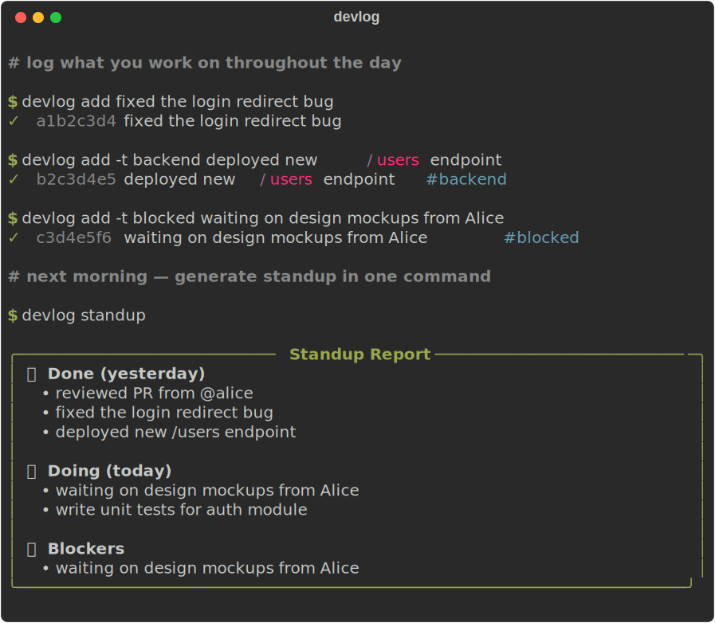

<div align="center">

# devlog

**Stop wondering what you did yesterday.**

`devlog` logs what you work on throughout the day and generates a clean standup report in seconds — no accounts, no cloud, no nonsense.

[](https://python.org)
[](LICENSE)
[](https://pypi.org/project/devlog-cli/)

<br>



</div>

---

## Install

```bash
pip install devlog-cli
```

## Usage

```bash
# Log what you're doing as you work
devlog add fixed the login redirect bug
devlog add -t backend deployed new /users endpoint
devlog add -t blocked waiting on design mockups from Alice

# Next morning — generate standup in one command
devlog standup
```

## Commands

| Command | Description |
|---|---|
| `devlog add <message>` | Add a log entry |
| `devlog add -t TAG <message>` | Add entry with tag |
| `devlog today` | Show today's entries |
| `devlog yesterday` | Show yesterday's entries |
| `devlog standup` | Print standup report |
| `devlog week` | This week's overview |
| `devlog ls` | Recent entries (last 7 days) |
| `devlog ls -d 30` | Entries from last 30 days |
| `devlog delete <id>` | Delete an entry by ID |

## Tags

Tag entries with `-t` to organize them. Entries tagged `blocked` automatically appear in the **Blockers** section of the standup report:

```bash
devlog add -t blocked waiting on API keys from DevOps
#                   ↑ shows up under Blockers in `devlog standup`
```

## Why devlog?

- **Zero config** — works out of the box, no setup required
- **Local-first** — logs stored in `~/.devlog/logs.json`, your data stays yours
- **Fully offline** — no internet, no accounts, no tracking
- **Tiny** — two dependencies: [`click`](https://click.palletsprojects.com) + [`rich`](https://github.com/Textualize/rich)
- **Standup-ready** — copy-paste the output directly into Slack or Teams

## Data

All entries are stored locally in `~/.devlog/logs.json` as plain JSON:

```json
[
  {
    "id": "a1b2c3d4",
    "timestamp": "2026-06-13T10:23:45",
    "date": "2026-06-13",
    "message": "fixed the login redirect bug",
    "tags": []
  }
]
```

## License

[MIT](LICENSE)
